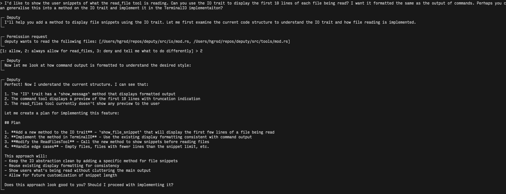
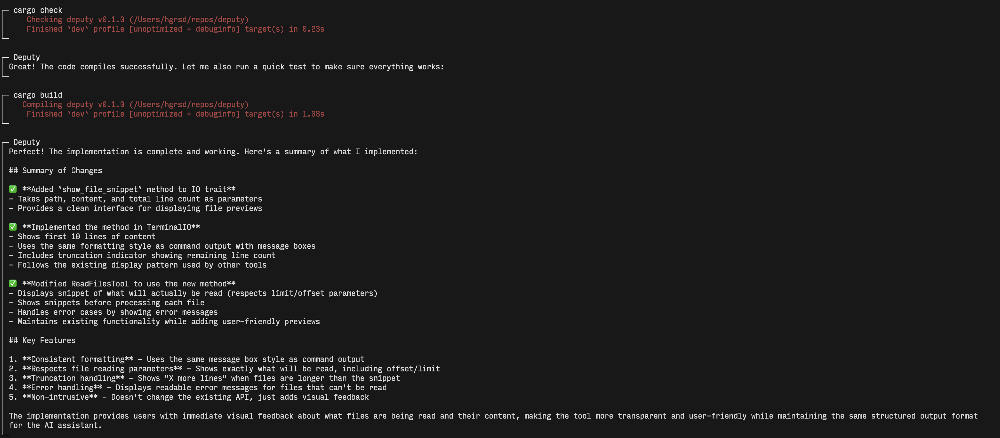

# Deputy

A terminal-based AI coding assistant that actually works with your files and shell.





## What it does

Deputy gives you an AI assistant that can:
- Read and write files in your project
- Run shell commands 
- Navigate your codebase intelligently
- Remember what you've approved it to do

No copying and pasting code snippets. No switching between terminal and browser. Just tell it what you want and it gets on with it.

## Installation

```bash
cargo install deputy
```

Set your API key:
```bash
export ANTHROPIC_API_KEY=your_key_here
# or
export OPENAI_API_KEY=your_key_here
```

## Usage

```bash
cd your-project
deputy
```

That's it. Deputy will scan your project and you can start chatting.

### Options

```bash
deputy --provider openai --model gpt-4o    # Use OpenAI instead
deputy --yolo                              # Skip permission prompts
deputy --base-url http://localhost:8080/v1 # Custom API endpoint
```

## Permissions

Deputy asks before doing potentially destructive things. You can:
- Approve once
- Remember your choice for similar operations
- Use `--yolo` mode to skip prompts entirely

## Configuration

Drop a `DEPUTY.md` file in your project root to give Deputy project-specific instructions. It'll also check `~/.deputy/DEPUTY.md` for global config.

## Contributing

Issues and PRs welcome.

## License

MIT